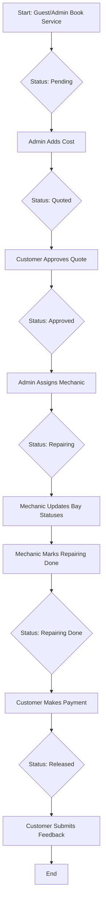

# Vehicle Service Management System - Documentation

## 1. Specification Sheet (Spec Sheet)

### Overview
The **Vehicle Service Management System** is a custom Frappe application designed to streamline the operations of a vehicle service center. it manages the end-to-end lifecycle of a service request, from initial booking to final release and customer feedback.

### Key Entities (DocTypes)

| DocType | Type | Description |
| :--- | :--- | :--- |
| **Vehicle Mechanic** | Master | Stores mechanic profiles, including skills, contact info, and linked Frappe User. |
| **Vehicle Service Request** | Transaction | The core document tracking vehicle details, problem description, cost, and service status. |
| **Vehicle Service Bay** | Child Table | Used within a Service Request to track individual operations (e.g., Oil Change, Washing). |
| **Vehicle Service Feedback** | Transaction | Captures customer ratings and comments after a service is completed. |

### Technical Specifications
- **Framework**: Frappe Framework
- **Backend**: Python (Frappe API)
- **Frontend**: Frappe Desk (for Admins/Mechanics) & Guest-accessible Web Portal
- **Database**: MariaDB
- **Naming Conventions**: 
  - Service Requests: `VSR-####`
  - Mechanics: `MECH-####`
  - Feedback: `FB-####`

---

## 2. Functionality

### Core Features

#### 1. Service Booking & Management
- **Customer Portal**: Customers can book services online by providing their details, vehicle info, and problem descriptions.
- **Service Request Tracking**: Real-time tracking of vehicle status using a defined workflow.
- **Quotation Management**: Admins can set a cost, and customers can approve the quotation through the portal.

#### 2. Mechanic Assignment & Workspace
- **Assignment**: Admins assign service requests to specific mechanics.
- **Mechanic Dashboard**: Mechanics can view their assigned tasks and update the status of repairs.
- **Operation Tracking (Bays)**: Detailed tracking of multiple operations (e.g., painting, welding, electrical) within a single service request.

#### 3. Payment & Completion
- **Payment Processing**: Ability to mark service requests as 'Paid' once work is complete.
- **Vehicle Release**: Formal closing of the service request.

#### 4. Customer Feedback
- **Post-Service Feedback**: Once the vehicle is released and paid, customers can submit a rating (1-5) and comments.

#### 5. Reporting & Analytics
- **Admin Stats**: A dashboard providing a summary of total customers, mechanics, enquiries, and feedback.

---

## 3. Workflow

The system follows a structured workflow to ensure accountability and communication at every stage.

### Workflow Stages

1.  **Pending**: The service request is created by a customer or admin.
2.  **Quoted**: The service advisor/admin inspects the vehicle and provides a cost estimate.
3.  **Approved**: The customer approves the quotation.
4.  **Repairing**: A mechanic is assigned and begins the work. Mechanics update the status of individual "Bays" (operations).
5.  **Repairing Done**: The mechanic completes all assigned tasks.
6.  **Released**: The vehicle is ready for pickup, payment is confirmed, and the request is closed.

### Workflow Diagram (Logic)

### Role-Based Actions

- **Customer**: Book service, Track status, Approve Quotation, Submit Feedback.
- **Mechanic**: View assigned requests, Update Bay status, Mark repair as completed.
- **System Manager / Admin**: Create/Edit records, Assign Mechanics, Manage Costs, View overall statistics.
